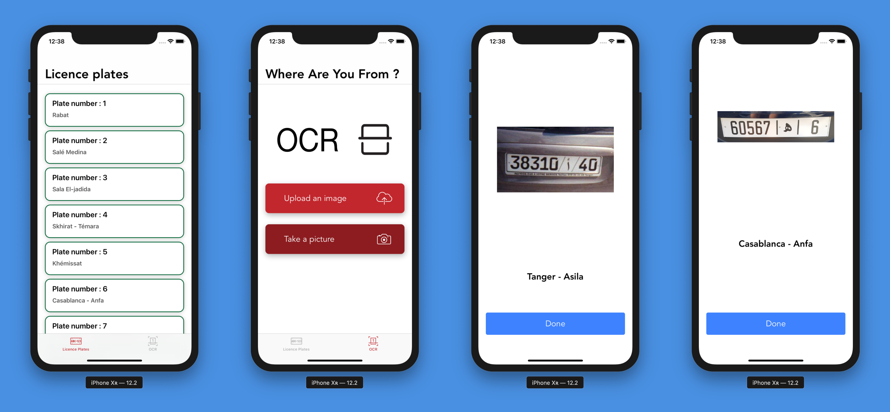
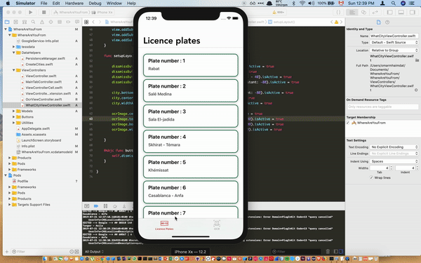

# Creating a License Plate Reading iOS Application Using OCR Technologies and CoreData
>Full tutorial using different libraries — TesseractOCRiOS, SwiftOCR, and Google MLVision | Can we beat Google?

Let’s dive into the world of vision for iOS devices, for the purpose of this tutorial, we will be reading license plates and identifying the city it’s registered in. Our application will be called “Where Are You From?”

## Final Result:

**Here’s the final result with the face detection and recognition.**

Distributed under the MIT license. See ``LICENSE`` for more information.

